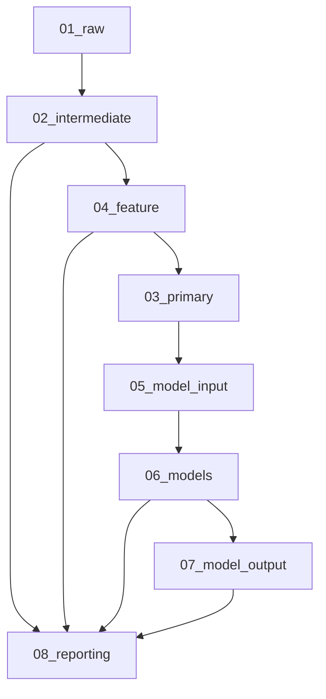

# 🔄 Guía de Pipelines - League of Legends Worlds Analysis

## 📋 Tabla de Contenidos

- [Arquitectura de Pipelines](#arquitectura-de-pipelines)
- [Pipeline de Exploración de Datos](#pipeline-de-exploración-de-datos)
- [Pipeline de Preparación de Datos](#pipeline-de-preparación-de-datos)
- [Pipeline Completo](#pipeline-completo)
- [Flujo de Datos](#flujo-de-datos)
- [Configuración de Pipelines](#configuración-de-pipelines)
- [Ejecución de Pipelines](#ejecución-de-pipelines)
- [Monitoreo y Logging](#monitoreo-y-logging)

---

## 🏗️ Arquitectura de Pipelines

### Estructura General

El proyecto utiliza **Kedro** como framework de pipeline de datos, siguiendo la metodología **CRISP-DM**:

```
src/league_of_legends_worlds/
├── pipelines/
│   ├── data_exploration.py    # Análisis exploratorio
│   ├── data_preparation.py    # Preparación y limpieza
│   └── nodes.py              # Nodos individuales
├── pipeline_registry.py      # Registro de pipelines
└── settings.py               # Configuración
```

### Metodología CRISP-DM

| Fase | Pipeline | Descripción |
|------|----------|-------------|
| 1. Comprensión del Negocio | ✅ | Objetivos definidos |
| 2. Comprensión de los Datos | `data_exploration` | EDA y análisis de calidad |
| 3. Preparación de Datos | `data_preparation` | Limpieza y feature engineering |
| 4. Modelado | `full_pipeline` | Machine Learning |
| 5. Evaluación | `full_pipeline` | Métricas y validación |
| 6. Despliegue | `full_pipeline` | Reportes finales |

---

## 📊 Pipeline de Exploración de Datos

### Propósito
Analizar la calidad de los datos y generar insights iniciales.

### Nodos Principales

#### 1. `load_raw_data`
```python
def load_raw_data() -> Dict[str, pd.DataFrame]:
    """
    Carga datos desde archivos raw
    """
    return {
        "champions": pd.read_csv("data/01_raw/champions_stats.csv"),
        "players": pd.read_csv("data/01_raw/players_stats.csv"),
        "matches": pd.read_csv("data/01_raw/matchs_stats.csv")
    }
```

#### 2. `analyze_data_quality`
```python
def analyze_data_quality(
    champions: pd.DataFrame,
    players: pd.DataFrame,
    matches: pd.DataFrame
) -> pd.DataFrame:
    """
    Analiza calidad de datos y genera reporte
    """
    quality_report = []
    
    for name, df in [("champions", champions), ("players", players), ("matches", matches)]:
        report = {
            "dataset": name,
            "rows": len(df),
            "columns": len(df.columns),
            "missing_values": df.isnull().sum().sum(),
            "duplicates": df.duplicated().sum(),
            "memory_usage": df.memory_usage(deep=True).sum()
        }
        quality_report.append(report)
    
    return pd.DataFrame(quality_report)
```

#### 3. `generate_eda_report`
```python
def generate_eda_report(
    champions: pd.DataFrame,
    players: pd.DataFrame,
    matches: pd.DataFrame
) -> pd.DataFrame:
    """
    Genera reporte de análisis exploratorio
    """
    eda_insights = []
    
    # Análisis de champions
    champion_insights = {
        "metric": "champion_popularity",
        "top_champion": champions["champion"].mode().iloc[0],
        "total_champions": champions["champion"].nunique(),
        "avg_win_rate": champions["win_rate"].mean()
    }
    eda_insights.append(champion_insights)
    
    # Análisis de players
    player_insights = {
        "metric": "player_performance",
        "top_player": players.loc[players["efficiency_score"].idxmax(), "player"],
        "avg_efficiency": players["efficiency_score"].mean(),
        "total_players": players["player"].nunique()
    }
    eda_insights.append(player_insights)
    
    return pd.DataFrame(eda_insights)
```

### Ejecución
```bash
kedro run --pipeline data_exploration
```

### Outputs
- `data/08_reporting/data_quality_report.csv`
- `data/08_reporting/eda_report.csv`
- Logs detallados en `info.log`

---

## 🔧 Pipeline de Preparación de Datos

### Propósito
Limpiar, transformar y preparar datos para análisis avanzado.

### Nodos Principales

#### 1. `clean_champions_data`
```python
def clean_champions_data(champions: pd.DataFrame) -> pd.DataFrame:
    """
    Limpia datos de campeones
    """
    # Eliminar duplicados
    champions_clean = champions.drop_duplicates()
    
    # Imputar valores faltantes
    numeric_cols = champions_clean.select_dtypes(include=[np.number]).columns
    for col in numeric_cols:
        champions_clean[col].fillna(champions_clean[col].median(), inplace=True)
    
    # Limpiar nombres de campeones
    champions_clean["champion"] = champions_clean["champion"].str.strip()
    
    return champions_clean
```

#### 2. `clean_players_data`
```python
def clean_players_data(players: pd.DataFrame) -> pd.DataFrame:
    """
    Limpia datos de jugadores
    """
    # Eliminar duplicados
    players_clean = players.drop_duplicates()
    
    # Imputar valores faltantes
    numeric_cols = players_clean.select_dtypes(include=[np.number]).columns
    for col in numeric_cols:
        players_clean[col].fillna(players_clean[col].median(), inplace=True)
    
    # Limpiar nombres de jugadores
    players_clean["player"] = players_clean["player"].str.strip()
    players_clean["team"] = players_clean["team"].str.strip()
    
    return players_clean
```

#### 3. `clean_matches_data`
```python
def clean_matches_data(matches: pd.DataFrame) -> pd.DataFrame:
    """
    Limpia datos de partidos
    """
    # Eliminar duplicados
    matches_clean = matches.drop_duplicates()
    
    # Convertir duración a minutos
    matches_clean["duration_minutes"] = matches_clean["duration"] / 60
    
    # Crear variable binaria de resultado
    matches_clean["result_numeric"] = (matches_clean["result"] == "Win").astype(int)
    
    # Limpiar nombres de equipos
    matches_clean["team1"] = matches_clean["team1"].str.strip()
    matches_clean["team2"] = matches_clean["team2"].str.strip()
    
    return matches_clean
```

#### 4. `create_champion_features`
```python
def create_champion_features(champions: pd.DataFrame) -> pd.DataFrame:
    """
    Crea features derivadas para campeones
    """
    champions_features = champions.copy()
    
    # KDA mejorado
    champions_features["kda"] = champions_features.apply(
        lambda row: calculate_kda(row["kills"], row["deaths"], row["assists"]), 
        axis=1
    )
    
    # Efficiency Score
    champions_features["efficiency_score"] = champions_features.apply(
        calculate_efficiency_score, axis=1
    )
    
    # Categorías de rendimiento
    champions_features["performance_tier"] = pd.cut(
        champions_features["efficiency_score"],
        bins=3,
        labels=["Low", "Medium", "High"]
    )
    
    return champions_features
```

#### 5. `create_player_features`
```python
def create_player_features(players: pd.DataFrame) -> pd.DataFrame:
    """
    Crea features derivadas para jugadores
    """
    players_features = players.copy()
    
    # Kill Participation
    players_features["kill_participation"] = players_features.apply(
        lambda row: calculate_kill_participation(
            row["kills"], row["assists"], row["team_kills"]
        ), axis=1
    )
    
    # Gold Share
    players_features["gold_share"] = players_features.apply(
        lambda row: calculate_gold_share(
            row["gold"], row["team_gold"]
        ), axis=1
    )
    
    # Player Tier
    players_features["player_tier"] = pd.cut(
        players_features["efficiency_score"],
        bins=5,
        labels=["Bronze", "Silver", "Gold", "Platinum", "Diamond"]
    )
    
    return players_features
```

#### 6. `create_match_features`
```python
def create_match_features(matches: pd.DataFrame) -> pd.DataFrame:
    """
    Crea features derivadas para partidos
    """
    matches_features = matches.copy()
    
    # Categorías de duración
    matches_features["game_length_category"] = pd.cut(
        matches_features["duration_minutes"],
        bins=[0, 25, 35, 45, float('inf')],
        labels=["Short", "Medium", "Long", "Very Long"]
    )
    
    # Diferencia de nivel de equipos
    matches_features["team_level_diff"] = (
        matches_features["team1_level"] - matches_features["team2_level"]
    )
    
    return matches_features
```

### Ejecución
```bash
kedro run --pipeline data_preparation
```

### Outputs
- `data/02_intermediate/champions_clean.csv`
- `data/02_intermediate/players_clean.csv`
- `data/02_intermediate/matches_clean.csv`
- `data/04_feature/champions_features.csv`
- `data/04_feature/players_features.csv`
- `data/04_feature/matches_features.csv`

---

## 🎯 Pipeline Completo

### Propósito
Ejecutar todo el flujo desde datos raw hasta modelos finales.

### Flujo Completo

```python
def create_full_pipeline() -> Pipeline:
    """
    Crea pipeline completo con todos los nodos
    """
    return Pipeline([
        # Carga de datos
        node(
            func=load_raw_data,
            inputs=None,
            outputs="raw_data",
            name="load_raw_data"
        ),
        
        # Exploración
        node(
            func=analyze_data_quality,
            inputs=["champions", "players", "matches"],
            outputs="data_quality_report",
            name="analyze_data_quality"
        ),
        
        # Limpieza
        node(
            func=clean_champions_data,
            inputs="champions",
            outputs="champions_clean",
            name="clean_champions_data"
        ),
        
        # Feature Engineering
        node(
            func=create_champion_features,
            inputs="champions_clean",
            outputs="champions_features",
            name="create_champion_features"
        ),
        
        # Consolidación
        node(
            func=consolidate_data,
            inputs=["champions_features", "players_features", "matches_features"],
            outputs="worlds_consolidated",
            name="consolidate_data"
        ),
        
        # Machine Learning
        node(
            func=train_models,
            inputs="worlds_consolidated",
            outputs="trained_models",
            name="train_models"
        ),
        
        # Reportes finales
        node(
            func=generate_final_report,
            inputs=["trained_models", "worlds_consolidated"],
            outputs="final_report",
            name="generate_final_report"
        )
    ])
```

### Ejecución
```bash
kedro run --pipeline full_pipeline
```

---

## 📊 Flujo de Datos

### Estructura de Directorios

```
data/
├── 01_raw/              # Datos originales
│   ├── champions_stats.csv
│   ├── players_stats.csv
│   └── matchs_stats.csv
├── 02_intermediate/     # Datos limpios
│   ├── champions_clean.csv
│   ├── players_clean.csv
│   └── matches_clean.csv
├── 03_primary/          # Datos consolidados
│   └── worlds_consolidated.csv
├── 04_feature/          # Features derivadas
│   ├── champions_features.csv
│   ├── players_features.csv
│   └── matches_features.csv
├── 05_model_input/      # Datos para ML
│   └── worlds_final.csv
├── 06_models/           # Modelos entrenados
│   ├── champion_model.pkl
│   ├── player_model.pkl
│   └── match_model.pkl
├── 07_model_output/     # Resultados de modelos
│   ├── predictions.csv
│   └── model_metrics.csv
└── 08_reporting/        # Reportes generados
    ├── data_quality_report.csv
    ├── eda_report.csv
    └── final_report.csv
```

### Flujo de Transformación



---

## ⚙️ Configuración de Pipelines

### Catalog Configuration

`conf/base/catalog.yml`:
```yaml
champions_stats:
  type: pandas.CSVDataSet
  filepath: data/01_raw/champions_stats.csv

champions_clean:
  type: pandas.CSVDataSet
  filepath: data/02_intermediate/champions_clean.csv

champions_features:
  type: pandas.CSVDataSet
  filepath: data/04_feature/champions_features.csv

trained_models:
  type: pickle.PickleDataSet
  filepath: data/06_models/trained_models.pkl
```

### Parameters Configuration

`conf/base/parameters.yml`:
```yaml
data_cleaning:
  remove_duplicates: true
  imputation_strategy: "median"
  outlier_threshold: 3.0

feature_engineering:
  kda_weights:
    kills: 1.0
    deaths: 1.0
    assists: 0.5
  
  efficiency_weights:
    kda: 0.3
    cs: 0.2
    gold: 0.2
    damage: 0.2
    participation: 0.1

machine_learning:
  test_size: 0.2
  random_state: 42
  n_estimators: 100
```

---

## 🚀 Ejecución de Pipelines

### Comandos Básicos

```bash
# Ejecutar pipeline específico
kedro run --pipeline data_exploration
kedro run --pipeline data_preparation
kedro run --pipeline full_pipeline

# Ejecutar nodo específico
kedro run --node analyze_data_quality

# Ejecutar desde nodo específico
kedro run --from-nodes create_champion_features

# Ejecutar hasta nodo específico
kedro run --to-nodes consolidate_data
```

### Comandos Avanzados

```bash
# Ejecutar con parámetros específicos
kedro run --params data_cleaning.remove_duplicates:false

# Ejecutar en paralelo
kedro run --parallel

# Ejecutar con logging detallado
kedro run --verbose

# Ejecutar solo si hay cambios
kedro run --checkpoint
```

### Ejecución Programática

```python
from kedro.framework.session import KedroSession

# Crear sesión
with KedroSession.create() as session:
    # Ejecutar pipeline
    session.run(pipeline_name="data_exploration")
    
    # Obtener contexto
    context = session.load_context()
    
    # Acceder a catálogo
    catalog = context.catalog
    champions = catalog.load("champions_stats")
```

---

## 📊 Monitoreo y Logging

### Configuración de Logging

`conf/logging.yml`:
```yaml
version: 1
disable_existing_loggers: False

formatters:
  standard:
    format: "%(asctime)s - %(name)s - %(levelname)s - %(message)s"

handlers:
  console:
    class: logging.StreamHandler
    level: INFO
    formatter: standard
    stream: ext://sys.stdout
  
  file:
    class: logging.FileHandler
    level: DEBUG
    formatter: standard
    filename: info.log
    mode: a

loggers:
  kedro:
    level: INFO
    handlers: [console, file]
    propagate: no
  
  league_of_legends_worlds:
    level: DEBUG
    handlers: [console, file]
    propagate: no
```

### Métricas de Pipeline

```python
def log_pipeline_metrics(context, **kwargs):
    """
    Hook para registrar métricas del pipeline
    """
    logger = logging.getLogger(__name__)
    
    # Métricas de tiempo
    execution_time = time.time() - start_time
    logger.info(f"Pipeline ejecutado en {execution_time:.2f} segundos")
    
    # Métricas de datos
    for dataset_name in ["champions", "players", "matches"]:
        if dataset_name in context.catalog.list():
            df = context.catalog.load(dataset_name)
            logger.info(f"{dataset_name}: {len(df)} filas, {len(df.columns)} columnas")
```

### Hooks de Pipeline

```python
# hooks.py
from kedro.framework.hooks import hook_impl

class PipelineHooks:
    @hook_impl
    def before_pipeline_run(self, run_params, pipeline, catalog):
        """Ejecutar antes del pipeline"""
        logging.info(f"Iniciando pipeline: {run_params['pipeline_name']}")
    
    @hook_impl
    def after_pipeline_run(self, run_params, pipeline, catalog):
        """Ejecutar después del pipeline"""
        logging.info(f"Pipeline completado: {run_params['pipeline_name']}")
```

---

## 🔧 Troubleshooting

### Problemas Comunes

#### 1. Pipeline no encuentra datos
```bash
# Verificar que los datos están en la ubicación correcta
ls -la data/01_raw/

# Verificar configuración del catálogo
kedro catalog list
```

#### 2. Error de memoria
```python
# Reducir tamaño de datos para testing
def sample_data(df, sample_size=1000):
    return df.sample(n=min(sample_size, len(df)), random_state=42)
```

#### 3. Pipeline lento
```bash
# Ejecutar en paralelo
kedro run --parallel

# Usar checkpointing
kedro run --checkpoint
```

### Debugging

```bash
# Ejecutar con logging detallado
kedro run --verbose --pipeline data_exploration

# Ver logs en tiempo real
tail -f info.log

# Verificar estado del catálogo
kedro catalog list --verbose
```

---

## 📈 Mejores Prácticas

### 1. Modularidad
- Dividir pipelines en componentes lógicos
- Usar nodos pequeños y específicos
- Evitar nodos que hagan demasiadas cosas

### 2. Reutilización
- Crear funciones utilitarias comunes
- Usar parámetros para configuración
- Mantener interfaces consistentes

### 3. Testing
- Probar cada nodo individualmente
- Usar datos de prueba pequeños
- Validar outputs esperados

### 4. Documentación
- Documentar propósito de cada nodo
- Explicar transformaciones complejas
- Mantener logs informativos

---

**🎮 ¡Pipelines listos para el análisis!** Con esta configuración puedes ejecutar análisis completos de datos de League of Legends Worlds de manera reproducible y escalable.
